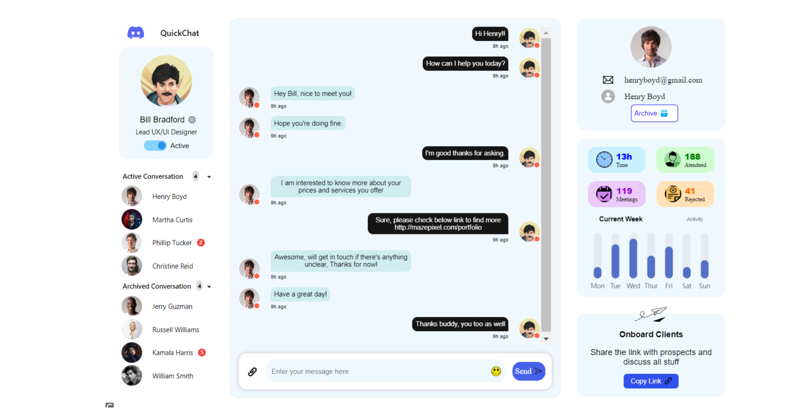

# Quick Chat App

A modern, feature-rich chat application built with React.js that provides real-time messaging capabilities with a beautiful and intuitive user interface.



## Live Demo

Check out the live demo: [Quick Chat App](https://ww3hpo.csb.app/)

## Features

- 💬 Real-time messaging
- 👤 User authentication
- 🎨 Modern and responsive UI
- 😊 Emoji support
- 📱 Mobile-friendly design
- 🔄 Redux state management
- 📊 Message history
- 🎯 User presence indicators

## Tech Stack

- **Frontend Framework:** React.js
- **State Management:** Redux
- **UI Components:** 
  - Material-UI (MUI)
  - React Bootstrap
  - MDB React UI Kit
- **Styling:** CSS, Emotion
- **Additional Libraries:**
  - React Avatar for user avatars
  - React Input Emoji for emoji support
  - ECharts for data visualization
  - React Chart.js for charts
  - React FusionCharts for advanced charts

## Getting Started

### Prerequisites

- Node.js (v14 or higher)
- npm or yarn

### Installation

1. Clone the repository:
   ```bash
   git clone https://github.com/yourusername/quick-chat-app.git
   ```

2. Navigate to the project directory:
   ```bash
   cd quick-chat-app
   ```

3. Install dependencies:
   ```bash
   npm install
   # or
   yarn install
   ```

4. Start the development server:
   ```bash
   npm start
   # or
   yarn start
   ```

The application will be available at `http://localhost:3000`

## Available Scripts

- `npm start` - Runs the app in development mode
- `npm test` - Launches the test runner
- `npm run build` - Builds the app for production
- `npm run eject` - Ejects from Create React App

## Contributing

Contributions are welcome! Please feel free to submit a Pull Request.

## License

This project is licensed under the MIT License - see the LICENSE file for details.

## Acknowledgments

- React.js community
- Material-UI team
- All contributors and supporters

---

Made with ❤️ by [Your Name]